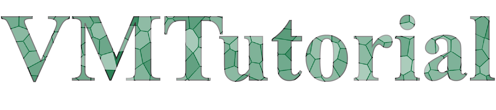

# A Fork of Rastko Sknepnek's vertex model tutorial repo

Lorentz Centre workshop Computational Advances in Active Matter (11 - 15 December 2023)
The Erwin Schrödinger International Institute for Mathematics and Physics summer school on Non-equilibrium Processes in Physics and Biology
(19 - 30 August 2024)

# Tutorial on Vertex Model

A showcase implementation of the vertex model for tissue mechanics.

## Project description (old)

This tutorial provides a simple C++ implementation of the basic vertex model for tissue mechanics. 
Python interface is provided using the [pybind11](https://github.com/pybind/pybind11) library.

The aim of this tutorial is to be clear and pedagogical even it if it comes at some performance cost. 
This tutorial is not intended for research, but could be used to develop research-quality tools.

## Requirements (old)

Python reqs:
 - shapely
 
for visualization
 - plotly
 - pandas

The package is tested on Linux and Mac OSX.

You will need:

- boost

Depending on your local Python installation, both can be installed through conda or pip.

## Installation

Clone the code repository into the VMToolkit directory.

From the VMToolkit directory type:

```
pip install .
```

For offline build, make sure all build system dependencies from pyproject.toml are installed, and run:
```
python -m pip install . --no-deps --no-build-isolation
```

This should build and install the package into your local site-packages directory.

## Structure

- examples - contains several examples on how to run a simulation
- VMToolkit - the source code for the vertex model simulation and data analysis
- config_builder - several tools for building initial configurations

## Running 

If the installation was successful, one can type (e.g., is an IPython console):

```
from VMToolkit.VM import *
from VMToolkit.VMAnalysis import *
```
